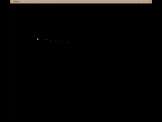
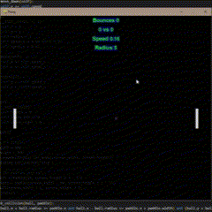
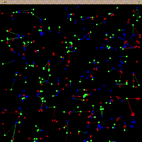

# **Python Experiments**

Dieses Repository enthält verschiedene kleine Python-Programme, die unterschiedliche Konzepte und Techniken demonstrieren.

**Ausführung:**

`python xyz.py`

Die meisten Programme erfordern `pygame`:

`pip install pygame`

## **Enthaltene Dateien**

1. `arr_filter.py`

Ein Skript zur Filterung von Arrays basierend auf bestimmten Bedingungen. Es zeigt den Umgang mit Listen und bedingten Filtern in Python.

2. `mousedraw.py`

Ein einfaches Zeichenprogramm mit der Maus, das mit `pygame` implementiert wurde. Beim Bewegen der Maus wird ein kleiner Punkt gezeichnet, dessen Farbe zufällig variiert. Das Mausrad kann verwendet werden, um die Größe des gezeichneten Punkts anzupassen.

**Funktionen:**
- Zeichnen eines Punkts an der aktuellen Mausposition
- Zufällige Farbänderung des Punkts bei Bewegung
- Anpassung der Punktgröße mit dem Mausrad

3. `pong.py`

Eine einfache Implementierung des klassischen Pong-Spiels mit `pygame`. Das Spiel enthält:

- Zwei automatisch oder manuell gesteuerte Paddles
- Einen Ball, der sich über den Bildschirm bewegt und von den Paddles sowie den Bildschirmrändern abprallt
- Ein Punktesystem, das die erzielten Treffer für die Spieler speichert
- Eine einfache Benutzeroberfläche zur Anzeige von Bounce-Zählung, Punktestand, Geschwindigkeit und Ballradius

Das Spiel kann mit den Tasten `W` und `S` für das linke Paddle sowie `Pfeil hoch` und `Pfeil runter` für das rechte Paddle gesteuert werden. Bei jedem Treffer des Balls wird dessen Geschwindigkeit leicht erhöht.

4. `ssp.py`

Ein Programm zur Umsetzung von "Schere, Stein, Papier". Es könnte eine einfache Text-basierte oder grafische Implementierung sein, um gegen einen Computergegner zu spielen.

5. `triangle.py`

Ein Skript zur Darstellung oder Berechnung von Dreiecken. Dies könnte entweder eine grafische Visualisierung oder eine mathematische Berechnung von Dreiecksparametern umfassen.

Nutzung

Jedes Skript kann mit Python ausgeführt werden. Falls eine spezielle Bibliothek benötigt wird, sollte sie vorab installiert werden (z. B. pygame für grafische Programme).

python <filename>.py

Lizenz

Dieses Repository steht unter keiner spezifischen Lizenz. Die Nutzung erfolgt auf eigene Verantwortung.

